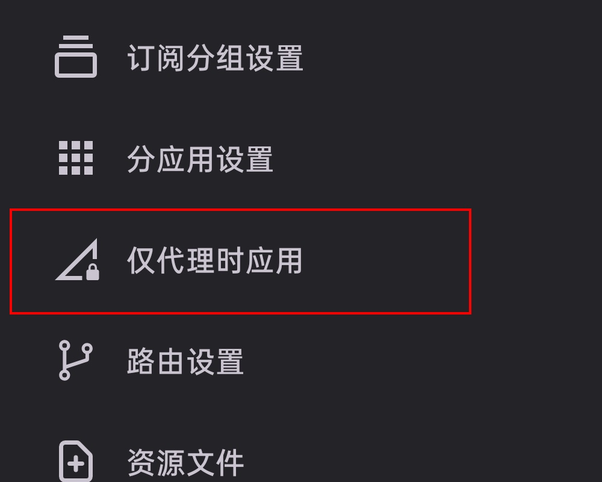
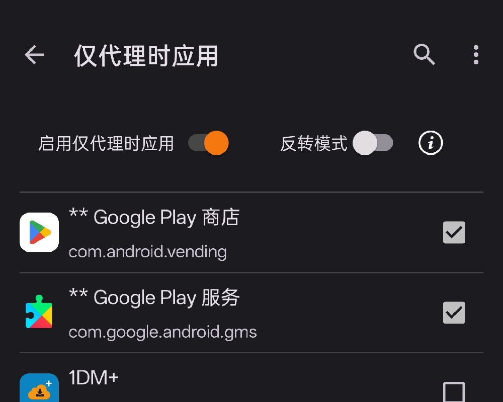

# v2rayNG Next

A V2Ray client for Android, forked from [2dust/v2rayNG](https://github.com/2dust/v2rayNG) and made great again. 
   
An opinionately power user version (therefore incompatible with the original public-facing project)

# Extra Features

## Proxied Only Apps
> Requires Shizuku API.  
> Install and launch [RikkaApps/Shizuku](https://github.com/RikkaApps/Shizuku) first

Disable & Enable certain selected apps based on proxy state.  

Supports both forward (App enabled only on proxy) and inverse (App disabled while on proxy)
  
Use cases include:
- Disable Google Play Store in network environments where it can't be reached, shutting off the outrageous retry polling it fires, to reduce power draw
- While VPN active, freeze government apps with background processes that constantly monitor network state, so that these apps will not know about the VPN at all
- And more to explore!
  
Showcase:

  
  

  

  
# Download
See [Releases](https://github.com/Lemocuber/v2rayNG-Next/releases)

# Dev Plan
This repo currently tracks the last release from the original v2rayNG.
Might be synced with upstream later, for major versions.